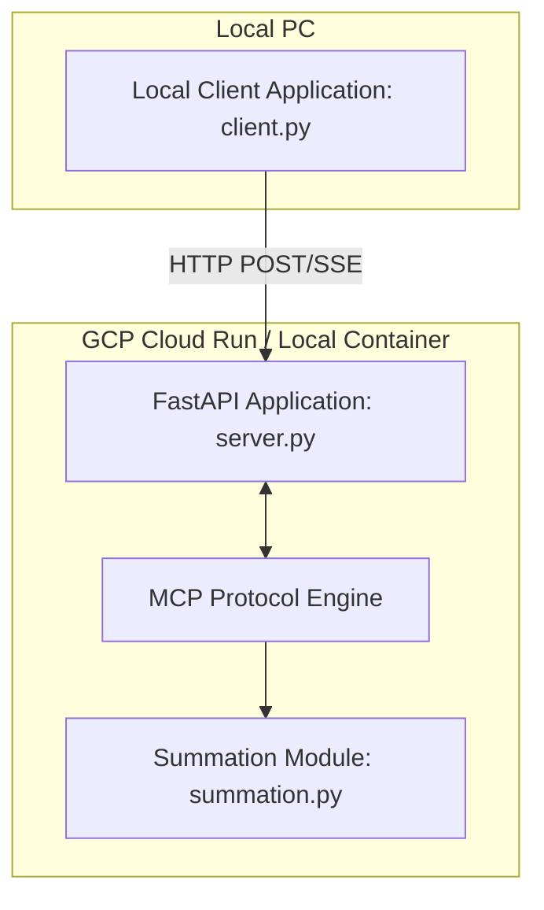

# Specification - Build MCP Summation Server with SSE and Local client application

This document defines the requirements, architecture, and deployment model for the MCP Summation Server.

---

## 1. Requirements & Scope

### Goal
Implement a lightweight Model Context Protocol (MCP) server that exposes a computational tool to calculate the sum of all integers between a lower bound and an upper bound. The server must handle massive ranges efficiently and be fully prepared for Docker containerization and Google Cloud Run deployment. Additionally, a local PC command-line application will be created to query the server and verify functionality.

### Core Features
1. **Model Context Protocol Server**:
   - Implements the MCP specification using the official Python SDK (`mcp`).
   - Exposes a tool named `calculate_sum`.
   - Arguments:
     - `low` (integer, required): The lower boundary of the range.
     - `high` (integer, required): The upper boundary of the range.
   - Response:
     - Returns a JSON payload containing the calculated sum and a brief message confirming the calculation.

2. **Streamable HTTP (SSE) Transport**:
   - Since standard stdio transport is not compatible with Cloud Run (which runs serverless web containers), the server must use the **Server-Sent Events (SSE)** transport layer via FastAPI/Starlette.
   - Endpoint `/sse`: Establishes the SSE channel for receiving protocol events from clients.
   - Endpoint `/messages`: Receives messages from clients to route them to the protocol session.

3. **Range Summation Logic & Safety**:
   - Handles standard range summation iteratively if the range is small ($high - low \le 10,000,000$).
   - **Optimization**: If the range is extremely large ($high - low > 10,000,000$), the server must use the mathematical analytical summation formula:
     $$\text{Sum} = \frac{(high - low + 1) \times (low + high)}{2}$$
     This optimizes the computation to $O(1)$ complexity, preventing memory exhaustion and timeout errors on serverless environments.
   - **Reversed Bounds**: If `low > high`, the server must log a warning and automatically swap the values to perform the sum correctly, preventing negative range bugs.

4. **Local Client Application (`client.py`)**:
   - A lightweight command-line script runnable on a local PC.
   - Queries the local or deployed Cloud Run server via SSE HTTP transport.
   - Accepts `--low` (or `-l`) and `--high` (or `-u`) command-line arguments and outputs the result returned by the server.

5. **Cloud Run Ready**:
   - A standard, secure `Dockerfile` running Python 3.11-slim.
   - Configured to run as a non-root user (`appuser`) for security compliance.
   - Exposes port `8080` (or uses the `PORT` environment variable).
   - Provides a `/health` endpoint for readiness/liveness checks.

---

## 2. Technical Architecture

### Component Diagram



### File Layout
```
.
├── .agents/                    # Custom agent skills
├── conductor/                  # Conductor tracking artifacts
├── tests/
│   ├── __init__.py
│   ├── test_summation.py       # TDD unit tests for summation logic
│   └── test_server.py          # TDD integration tests for FastAPI / SSE endpoints
├── server.py                   # FastAPI / SSE MCP Server
├── summation.py                # Core range summation logic
├── client.py                   # Local PC command-line client
├── Dockerfile                  # Production-ready docker container
├── requirements.txt            # Python dependencies
└── README.md                   # Project documentation
```
